# 📖 Reader — Telegram Mini App

[](https://nodejs.org/)
[](https://www.mongodb.com/)

> **A personal quote diary Telegram Mini App for psychologist Anna Busel**  
> Helps readers capture meaningful book quotes, receive AI-powered weekly insights, and discover personalized book recommendations.

**📱 Open in Telegram:** [https://t.me/reader_app_bot/Reader](https://t.me/reader_app_bot/Reader)

> ⚠️ **Note:** This app runs inside Telegram WebApp. Opening the VPS domain directly will not load the UI. For local development use the Mock Telegram WebApp SDK (see Local Testing).

### How to open in Telegram
1. Click the link above or search for `@reader_app_bot` in Telegram
2. Start a chat with the bot
3. Tap the "Reader" menu button or send `/start` to launch the Mini App

---

## 📦 What's covered in this repo

This repository includes:
- **End-to-end manual testing assets** — Device matrix, smoke test cases, bug report template
- **Documentation** — README, PROJECT_KNOWLEDGE, .env.example
- **Telegram WebApp SDK mock** — For local development and testing outside Telegram
- **VPS deployment notes** — Contabo hosting setup with PM2 process management and MongoDB via Docker

> 📄 For deeper project status, implementation details, and known issues, see [PROJECT_KNOWLEDGE.md](docs/PROJECT_KNOWLEDGE.md).

---

## ⚡ How to evaluate in 2 minutes

Quick walkthrough of main Telegram flow:

1. **Open bot → Open Reader → allow web app**  
   _Expected:_ Onboarding flow (7-question personality test) or main app if already registered

2. **Add a quote (Diary) → see "Analysis from Anna"**  
   _Expected:_ Quote saved successfully; AI-powered analysis appears on the quote card

3. **Open Community feed → like a quote**  
   _Expected:_ Latest quotes from other readers displayed; like button toggles quote favoriting

4. **Open Catalog → view items**  
   _Expected:_ Curated psychology/self-help books load with breakdowns and recommendations

---

## 🛠 Tech Stack

### Frontend
- **Vanilla JavaScript (ES6)** — No frameworks, pure JavaScript with JSDoc type hints
- **HTML & CSS** — Mobile-first responsive design with CSS Variables for theming
- **Telegram Web App SDK** — Native integration with Telegram Mini Apps platform

### Backend
- **Node.js** — Express.js server with REST API
- **MongoDB** — NoSQL database for quotes, users, and reports

### Infrastructure
- **VPS Hosting** — Contabo VPS for production deployment
- **Process Manager** — PM2 for Node.js process management and auto-restart
- **Database** — MongoDB running via Docker on VPS
- **Deployment** — SSH-based deployment with manual push

---

## 📸 Screenshots

### Onboarding Flow
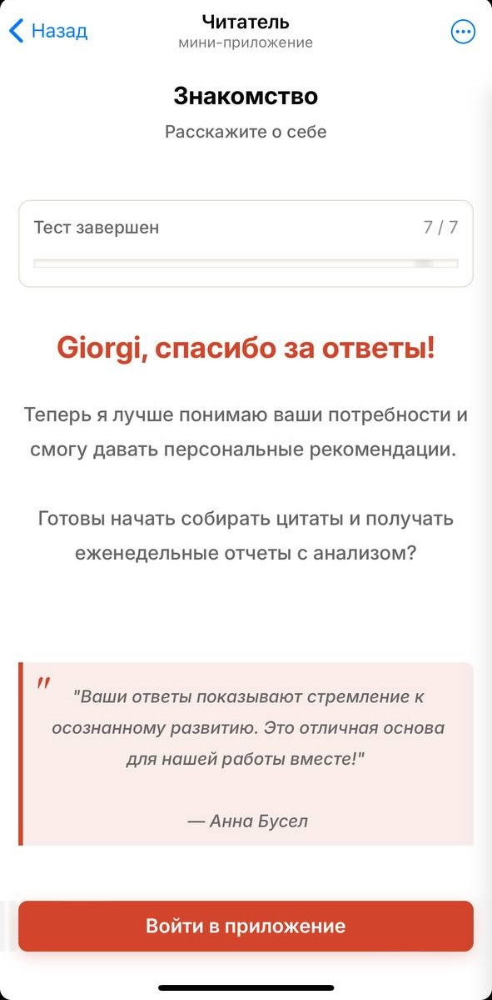

### Quote Creation
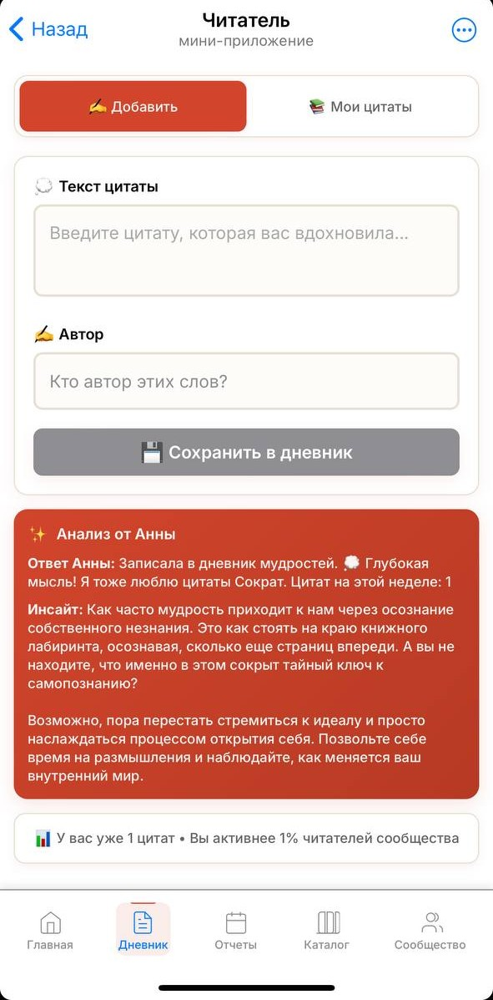

### Community Feed
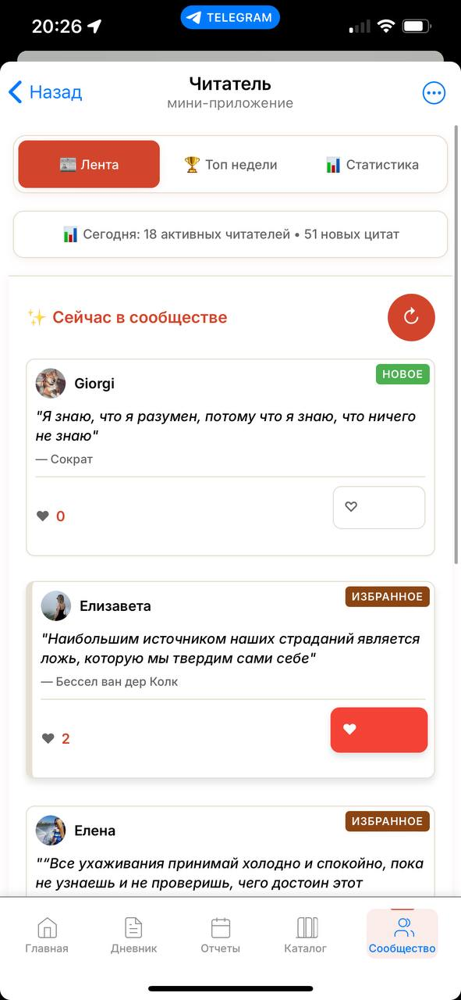

### Book Catalog
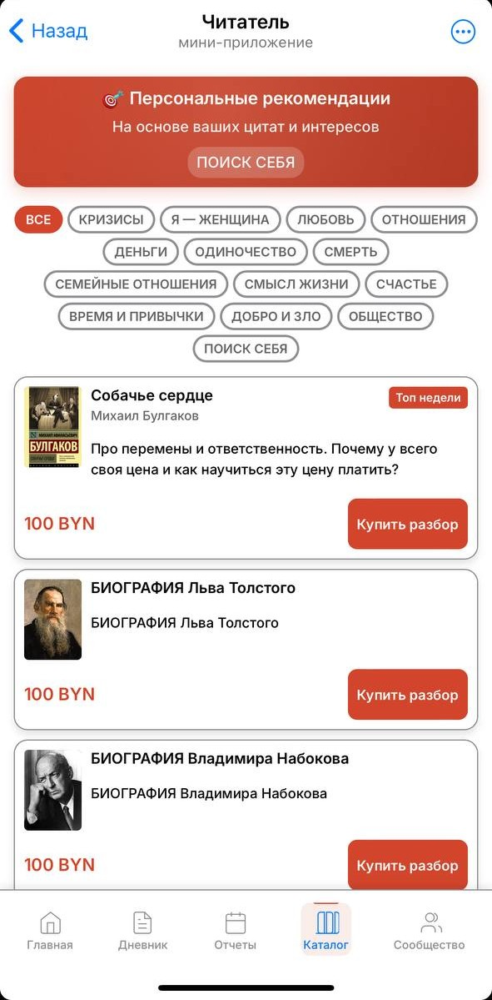

### Weekly AI Analysis
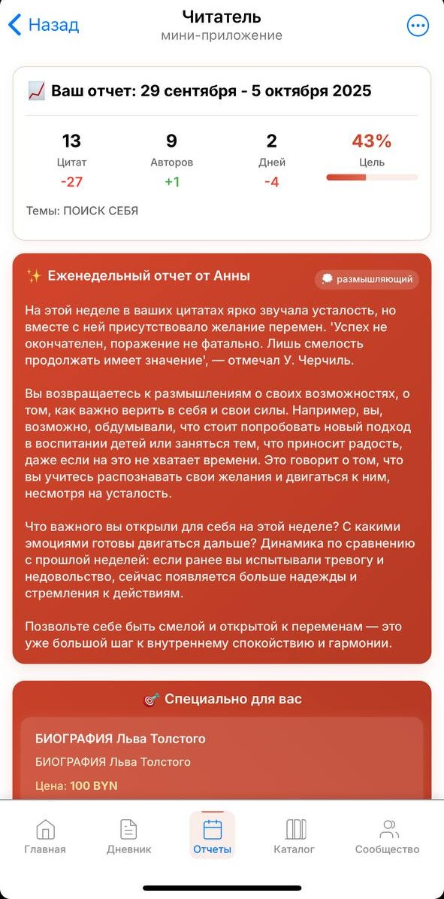

<details>
<summary><strong>View More Screenshots</strong></summary>

### Main Page
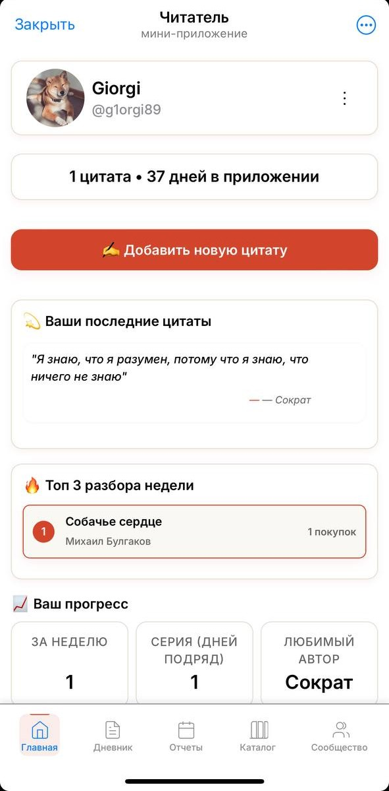

### Quote Diary
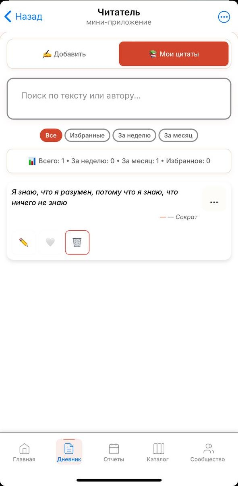

### Top of the Week
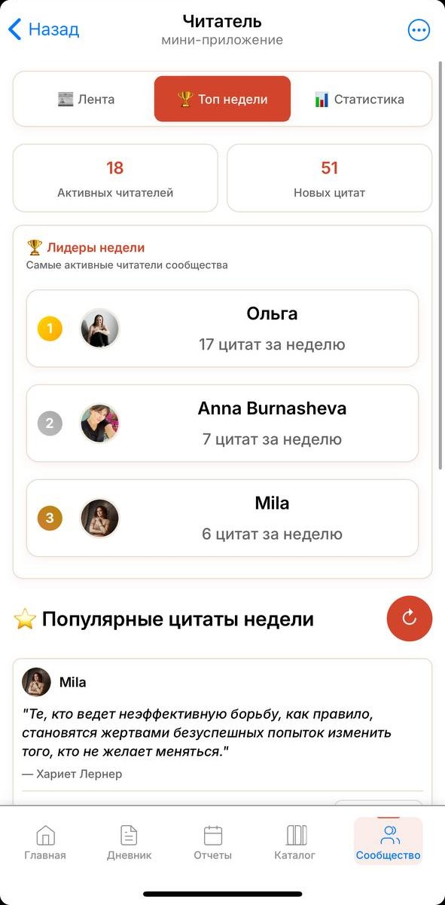

### Community Statistics
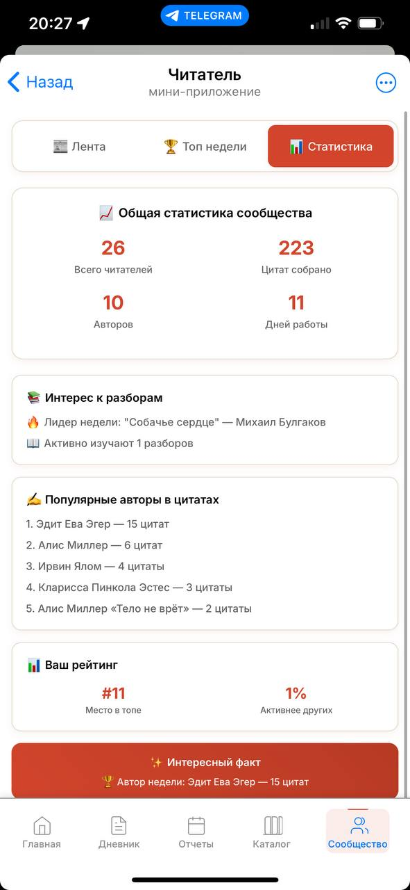

### Settings
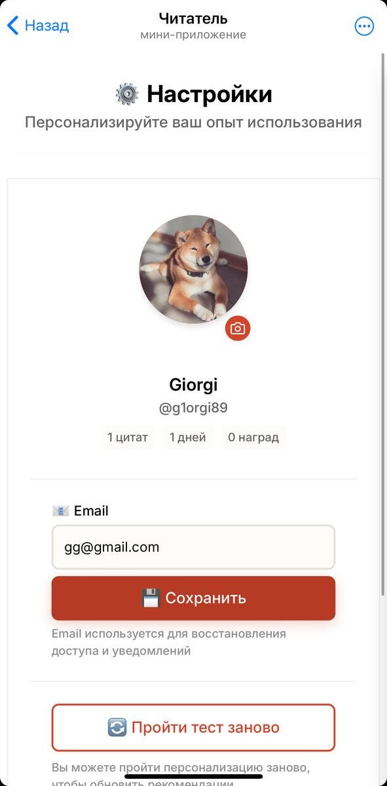

### Dark Theme
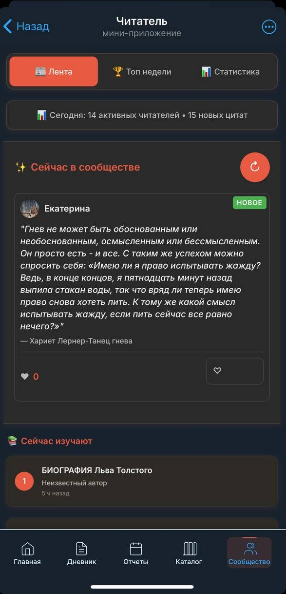

</details>

---

## ✨ Features

### ✅ Implemented Features

#### 📝 Core Functionality
- **7-Question Personality Test** — Onboarding flow to understand reader preferences and provide personalized recommendations
- **Quote Diary** — Save and organize meaningful quotes from books with author and book metadata
- **"Analysis from Anna"** — AI-powered reflective text analysis for each quote (GPT integration)
- **Daily Limits** — Smart limit enforcement (10 quotes/day) to encourage thoughtful curation

#### 📊 Reports & Analytics
- **Weekly Reports** — AI-powered psychological analysis delivered Sundays at 11:00
- **Personal Statistics** — Track reading streaks, quote counts, and engagement metrics
- **AI Integration** — GPT provider implemented and active; Anthropic (Claude) optional

#### 📚 Discovery & Community
- **Book Catalog** — Curated psychology & self-help books with breakdowns and recommendations
- **Community Feed** — Browse latest quotes from other readers with likes functionality
- **"Top of the Week"** — Highlighted popular quotes and community engagement
- **UTM Links** — Working click tracking in Catalog for marketing attribution

#### 🔔 Engagement
- **Telegram Reminders** — Configurable notifications via bot (implemented and active)
- **Profile & Settings** — User profile management and preferences

### 🚧 Planned / In Progress

- **Achievements & Gamification** — Badge system for milestones (UI designed, integration pending)
- **Admin Panel** — Pages and CSS exist; needs integration with existing API endpoints

### 💡 Proposed improvements (short)

- **Monthly report screen** — Full monthly summary
- **Public user profile card + subscribe** — Social features for following readers
- **Admin dashboard** — Analytics and content metrics
- **Top of the month** — Featured content in feed/catalog
- **Challenges + badges** — MVP gamification set
- **Subscriptions feed** — Following tab for subscribed users
- **Comments** — Basic commenting system
- **Share quote as image** — Export quotes as shareable graphics

---

##  🔐 License & Access

All rights reserved. This repository is public for evaluation by reviewers. Cloning for interview/review is allowed; redistribution and commercial use are prohibited. For permissions: g.akhmeteli89@gmail.com

> Note: The Reader Mini App UI runs inside Telegram WebApp. For demonstrations we provide screenshots and a demo video in docs/screenshots/; full developer setup is available on request.

---

## 🧪 Local Testing (Mini App)

The Telegram Mini App lives in `/mini-app`. To test locally **outside Telegram**:

### Option 1: Python HTTP Server

```bash
cd mini-app
python3 -m http.server 8080
# Open http://localhost:8080 in browser
```

### Option 2: Node.js http-server

```bash
npm install -g http-server
cd mini-app
http-server -p 8080
# Open http://localhost:8080
```

### Mock Telegram Web App SDK

For local testing, add this **before** loading `telegram-web-app.js`:

```html
<!-- Mock Telegram WebApp SDK for local testing -->
<script>
if (!window.Telegram) {
  window.Telegram = {
    WebApp: {
      initData: '',
      initDataUnsafe: { user: { id: 123456, first_name: 'Test', username: 'testuser' } },
      version: '6.0',
      platform: 'web',
      colorScheme: 'light',
      themeParams: {
        bg_color: '#ffffff',
        text_color: '#000000',
        hint_color: '#999999',
        link_color: '#D2452C',
        button_color: '#D2452C',
        button_text_color: '#ffffff'
      },
      isExpanded: false,
      viewportHeight: window.innerHeight,
      viewportStableHeight: window.innerHeight,
      headerColor: '#ffffff',
      backgroundColor: '#ffffff',
      BackButton: { isVisible: false, show: () => {}, hide: () => {}, onClick: () => {} },
      MainButton: { text: '', color: '#D2452C', textColor: '#fff', isVisible: false, isActive: true, show: () => {}, hide: () => {}, setText: () => {}, onClick: () => {} },
      ready: () => console.log('Mock Telegram.WebApp.ready()'),
      expand: () => console.log('Mock Telegram.WebApp.expand()'),
      close: () => console.log('Mock Telegram.WebApp.close()'),
      sendData: (data) => console.log('Mock sendData:', data),
      showAlert: (msg) => alert(msg),
      showConfirm: (msg) => confirm(msg),
      showPopup: (params) => alert(params.message)
    }
  };
  console.log('✅ Mock Telegram WebApp SDK loaded for local testing');
}
</script>
<script src="https://telegram.org/js/telegram-web-app.js"></script>
```

Insert this snippet into `mini-app/index.html` **temporarily** for local development (remove before production).

---

## 🎨 Design System

The Mini App uses a **CSS Variables-based design system** (no Tailwind/Bootstrap).

### Key Design Tokens

Defined in [`mini-app/css/variables.css`](mini-app/css/variables.css):

```css
--primary-color: #D2452C;     /* Terracotta (Anna Busel brand color) */
--bg-primary: #F5F2EC;        /* Light beige background */
--text-primary: #2C1810;      /* Dark brown text */
```

### Mobile Guidelines
- **Touch targets:** Minimum 44px (iOS guideline)
- **Typography:** +1px font scale on mobile (17px base instead of 16px)
- **Safe areas:** iOS notch/home indicator respected via `env(safe-area-inset-*)`

**Important:** Use only variables from `mini-app/css/variables.css`. Do NOT add or rename tokens.

---

## 🔌 API Reference

Base URL: `http://localhost:3002/api/reader`

### Authentication

**Telegram Auth:**
```bash
curl -X POST http://localhost:3002/api/reader/auth/telegram \
  -H "Content-Type: application/json" \
  -H "Authorization: tma <telegram_init_data>" \
  -d '{"userId": "123456", "firstName": "Anna"}'
```

### Quotes

**Create Quote:**
```bash
curl -X POST http://localhost:3002/api/reader/quotes \
  -H "Authorization: tma <init_data>" \
  -H "Content-Type: application/json" \
  -d '{"text": "To be or not to be", "bookTitle": "Hamlet", "author": "Shakespeare"}'
```

**Get User Quotes:**
```bash
curl http://localhost:3002/api/reader/quotes \
  -H "Authorization: tma <init_data>"
```

### Reports

**Weekly Reports:**
```bash
curl http://localhost:3002/api/reader/reports/weekly \
  -H "Authorization: tma <init_data>"
```

### Catalog

**Browse Books:**
```bash
curl http://localhost:3002/api/reader/catalog
```

**Get Recommendations:**
```bash
curl http://localhost:3002/api/reader/recommendations \
  -H "Authorization: tma <init_data>"
```

> **Note:** `<telegram_init_data>` is the initialization string from Telegram WebApp SDK. For full endpoint list, see [`server/api/reader.js`](server/api/reader.js).

---

## 🚀 Deployment (Production VPS)

The app is deployed on a **Contabo VPS** with the following setup:

### Infrastructure
- **Hosting:** Contabo VPS
- **API Host:** app.unibotz.com (backend API only, no public web UI)
- **Web Server:** Nginx reverse proxy
- **Process Manager:** PM2 for Node.js process management
- **Database:** MongoDB running via Docker on VPS
- **Deployment Method:** SSH-based manual deployment

> **Note:** The domain app.unibotz.com serves as the API host behind Nginx/PM2. The user interface is only accessible via the Telegram Mini App.

### PM2 Process Management

**Start the application:**
```bash
pm2 start server/index.js --name reader-bot
```

**Check status:**
```bash
pm2 status
```

**View logs:**
```bash
pm2 logs reader-bot
```

**Stop the application:**
```bash
pm2 stop reader-bot
```

**Restart after updates:**
```bash
pm2 restart reader-bot
```

### MongoDB via Docker

MongoDB runs as a Docker container on the VPS. The connection string in `.env` points to the containerized database instance.

---

## 🧪 QA & Testing Section

### Test Matrix

| Device/Browser       | Status | Notes                    |
|---------------------|--------|--------------------------|
| iPhone 14 / Safari  | ✅ Pass | Primary target           |
| Android / Chrome    | ✅ Pass | Tested on Pixel 6        |
| Desktop / Chrome    | ✅ Pass | With dev mock SDK        |
| iPad / Safari       | ⚠️ WIP  | Modal height issues      |

### Smoke Tests

**Pre-deployment checklist:**
1. ✅ User can complete onboarding (7-question test)
2. ✅ Quote submission works (text + book details)
3. ✅ Weekly report displays correctly
4. ✅ Catalog loads books without errors
5. ✅ Community feed shows latest quotes
6. ✅ Achievements page loads stats
7. ✅ Dark mode theme switches properly

### Sample Test Case

**TC-001: Quote Creation**
- **Preconditions:** User authenticated, onboarding complete
- **Steps:**
  1. Navigate to Diary page
  2. Tap "Add Quote" button
  3. Enter quote text, book title, author
  4. Submit form
- **Expected:** Quote appears in diary; success toast shown; daily limit counter decrements
- **Actual:** (To be filled by QA)

### Bug Report Template

```markdown
**Title:** [Component] Brief description

**Environment:**
- Device: iPhone 14 Pro
- OS: iOS 16.5
- Telegram: Latest version
- App Version: [Git commit SHA]

**Steps to Reproduce:**
1. Navigate to...
2. Click on...
3. Observe...

**Expected Behavior:**
Should display...

**Actual Behavior:**
Instead shows...

**Screenshots:**
[Attach images]

**Severity:** Critical / High / Medium / Low
**Logs:** (if available)
```

### Acceptance Criteria
- [ ] All pages load within 2 seconds on 3G
- [ ] No console errors on clean user flow
- [ ] Touch targets ≥ 44px on all interactive elements
- [ ] Proper error messages for API failures

### Performance & Accessibility
- **Lighthouse Score Target:** >90 (Performance, Accessibility)
- **Font Scaling:** Supports user-preferred text size (Settings page)
- **Color Contrast:** WCAG AA compliant (4.5:1 for body text)
- **Screen Readers:** Labels on all form inputs & buttons

**Run Lighthouse:** Open DevTools → Lighthouse → "Mobile" → Generate Report

---

## 🛠 Known Issues & Roadmap

### Known Issues

1. **Modal Overflow on Tall Screens**  
   - Modals may exceed viewport height on iPad and notched iPhones
   - Needs `max-height` with internal scroll (`max-height: calc(100vh - var(--safe-area-bottom))` + `overflow-y: auto`)
   - Priority: Medium

2. **iOS Safe Area Bottom Padding**  
   - Bottom navigation may overlap home indicator on newer iPhones
   - Requires testing on iPhone 15 Pro Max and refinement of `env(safe-area-inset-bottom)`
   - Priority: Medium

3. **Red Analysis Card Readability**  
   - Text contrast and line-height issues on "Analysis from Anna" cards
   - Needs improved line-height and contrast ratio adjustments
   - Priority: Low

4. **Touch Target Sizes**  
   - Some interactive elements are <44px (iOS guideline)
   - Full audit required to ensure all buttons/links meet ≥44px minimum
   - Priority: High

5. **Debug Logs in Production**  
   - Console logs not removed from some files
   - Need to strip all `console.log()` statements before release
   - Priority: High

### Short-Term Roadmap

- [ ] **Integrate Admin Panel** — Connect existing admin UI with Reader Bot API endpoints
- [ ] **Implement Achievements** — Complete gamification system with badge unlocking
- [ ] **Fix Modal/Safe-Area Issues** — Address modal overflow and iOS safe-area padding
- [ ] **Accessibility Fixes** — Ensure touch targets ≥44px, improve readability, add ARIA labels
- [ ] **Remove Debug Logs** — Strip all console logging for production
- [ ] **Add Smoke/E2E Tests** — Set up Playwright or similar for automated testing
- [ ] **Simple CI Setup** — Basic GitHub Actions for linting and tests
- [ ] **Validate Theme Handling** — Test Telegram dark/light mode theme switching

---

## ⚠️ Limitations

This project has the following constraints:

- **Telegram-only UI** — The VPS domain (app.unibotz.com) serves the API behind Nginx/PM2. There is no public web UI; the user interface is accessible only via the Telegram Mini App.
- **Pilot testing cohort** — Currently in testing phase with a limited user group.
- **API examples are illustrative** — Code samples in this README may differ from the current production implementation.

---

## 🤝 Contributing

This project is proprietary. Contributions are handled by maintainers. To propose changes or request access, contact: g.akhmeteli89@gmail.com

---

## 📞 Contact & Support

**Maintainer:** [@g1orgi89](https://github.com/g1orgi89)  
**Project owner / Client:** Anna Busel ([annabusel.org](https://annabusel.org))  
**Email:** g.akhmeteli89@gmail.com  
**Issues:** [GitHub Issues](https://github.com/g1orgi89/reader-bot/issues)

For urgent support, contact the development team via Telegram.

---

**Made with ❤️ for Anna Busel's Book Club Community**
