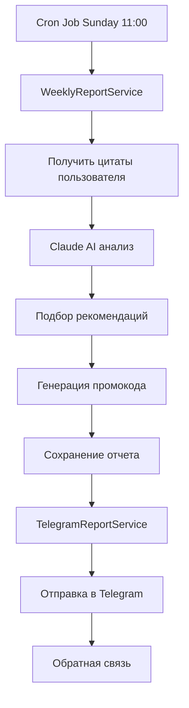

# 📖 Weekly Reports System - Reader Bot

Система еженедельных отчетов для проекта "Читатель" - автоматическая генерация и отправка персонализированных отчетов о активности пользователей с AI-анализом через Claude.

## 🎯 Обзор

Система автоматически генерирует еженедельные отчеты для пользователей Reader Bot, анализирует их цитаты с помощью Claude AI и отправляет персонализированные рекомендации книг от Анны Бусел.

### ✨ Основные функции

- **Автоматическая генерация отчетов** - каждое воскресенье в 11:00 МСК
- **AI-анализ цитат** - психологический анализ через Claude в стиле Анны Бусел
- **Персонализированные рекомендации** - подбор книг на основе анализа
- **Промокоды** - автоматическая генерация скидочных кодов
- **Система обратной связи** - кнопки оценки и комментарии
- **UTM трекинг** - отслеживание переходов по рекомендациям

## 🏗️ Архитектура

### Компоненты системы

```
📖 Weekly Reports System
├── 🕒 CronService - планировщик задач
├── 📊 WeeklyReportService - генерация отчетов  
├── 📱 TelegramReportService - отправка в Telegram
├── 🗄️ Models - данные отчетов
├── 🌐 API Routes - управление отчетами
└── 🔧 Types - JSDoc типизация
```

### Поток данных



## 📋 API Endpoints

### Статистика отчетов
```http
GET /api/reports/stats?days=30
```

### Ручная генерация отчетов
```http
POST /api/reports/weekly/generate
Content-Type: application/json

{
  "userId": "123456789",  // Опционально - для конкретного пользователя
  "weekNumber": 42,       // Опционально
  "year": 2024           // Опционально
}
```

### Отчеты пользователя
```http
GET /api/reader/reports/weekly/{userId}?limit=10
```

Пример ответа:
```json
{
  "success": true,
  "data": {
    "userId": "1798451247",
    "reports": [
      {
        "id": "68a32b3f4021c0f453d96ad8",
        "weekNumber": 34,
        "year": 2025,
        "quotesCount": 14,
        "sentAt": "2025-08-18T13:31:43.523Z",
        "isRead": false,
        "dominantThemes": ["Жизнь", "Любовь"],
        "emotionalTone": "позитивный",
        "analysis": {
          "summary": "Короткое резюме недели...",
          "insights": "Длинный подробный анализ недели...",
          "emotionalTone": "позитивный",
          "dominantThemes": ["Жизнь", "Любовь"]
        },
        "recommendations": []
      }
    ],
    "total": 1
  }
}
```

> Примечание: Для обратной совместимости поля dominantThemes и emotionalTone дублируются на верхнем уровне и внутри analysis.

### Отчеты пользователя (администраторский доступ)
```http
GET /api/reports/weekly/{userId}?limit=10
```

Возвращает тот же формат, что и выше, с полным объектом analysis.

### Добавление обратной связи
```http
POST /api/reports/weekly/{reportId}/feedback
Content-Type: application/json

{
  "rating": 5,
  "comment": "Отличный анализ!"
}
```

### Статус Telegram сервиса
```http
GET /api/reports/telegram/status
```

### Тестовая отправка
```http
POST /api/reports/telegram/test
Content-Type: application/json

{
  "userId": "123456789",
  "reportId": "report_id"  // Опционально
}
```

### Управление Cron задачами
```http
GET /api/reports/cron/status
POST /api/reports/cron/restart/weeklyReports
```

### Аналитика
```http
GET /api/reports/popular-themes?days=30&limit=10
GET /api/reports/analytics/overview?days=30
```

## 🔄 Cron Расписание

| Задача | Расписание | Описание |
|--------|------------|----------|
| Weekly Reports | Воскресенье 11:00 МСК | Генерация еженедельных отчетов |
| Morning Reminders | Ежедневно 9:00 МСК | Утренние напоминания |
| Evening Reminders | Ежедневно 19:00 МСК | Вечерние напоминания |
| Monthly Reports | 1 число 12:00 МСК | Месячные отчеты |
| Daily Cleanup | Ежедневно 3:00 МСК | Очистка данных |

## 🗄️ Модели данных

### WeeklyReport
```javascript
{
  userId: String,                    // Telegram user ID
  weekNumber: Number,                // ISO номер недели
  year: Number,                      // Год
  quotes: [ObjectId],               // Ссылки на цитаты
  analysis: {
    summary: String,                 // Краткий анализ
    dominantThemes: [String],        // Основные темы
    emotionalTone: String,           // Эмоциональный тон
    insights: String                 // Детальный анализ
  },
  recommendations: [{
    title: String,                   // Название книги
    description: String,             // Описание
    price: String,                   // Цена
    reasoning: String,               // Обоснование
    link: String                     // UTM ссылка
  }],
  promoCode: {
    code: String,                    // Код промокода
    discount: Number,                // Размер скидки %
    validUntil: Date                 // Срок действия
  },
  feedback: {
    rating: Number,                  // Оценка 1-5
    comment: String,                 // Комментарий
    respondedAt: Date                // Время ответа
  },
  sentAt: Date,                      // Время отправки
  isRead: Boolean,                   // Прочитан ли
  readAt: Date                       // Время прочтения
}
```

## 🎨 Формат Telegram сообщения

```markdown
📊 **Ваш отчет за неделю**

За эту неделю вы сохранили 5 цитат:

✅ "В каждом слове — целая жизнь" (Цветаева)
✅ "Любовь — это решение любить" (Фромм)
✅ "Счастье внутри нас" (Будда)

🎯 **Анализ недели:**
Ваши цитаты говорят о поиске внутренней гармонии...

💎 **Рекомендации от Анны:**
1. [Искусство любить](link) - $8
   О построении здоровых отношений

🎁 **Промокод READER20** - скидка 20% до среды!

---
💬 Как вам этот отчет?
[👍 Отлично] [👌 Хорошо] [👎 Плохо]
```

## 🤖 AI Промпты

### Анализ недели
```javascript
const weeklyAnalysisPrompt = `
Ты психолог Анна Бусел. Проанализируй цитаты пользователя за неделю.

Имя: ${userName}
Результаты теста: ${testResults}

Цитаты за неделю:
${quotesText}

Стиль: теплый, профессиональный, обращение на "Вы"
Формат: JSON с полями summary, dominantThemes, emotionalTone, insights
`;
```

### Рекомендации книг
```javascript
const bookRecommendationsPrompt = `
На основе анализа недели подбери 2-3 рекомендации из разборов Анны Бусел.

Доступные книги:
- "Искусство любить" ($8) - о здоровых отношениях
- "Письма к молодому поэту" ($8) - о самопознании
- "Быть собой" ($12) - о самопринятии

Формат: JSON массив с title, price, description, reasoning
`;
```

## 📊 Аналитика и метрики

### Основные метрики
- Общее количество отчетов
- Процент пользователей с обратной связью
- Средняя оценка отчетов
- Популярные темы и эмоциональные тона
- Эффективность рекомендаций (UTM клики)

### Отслеживание UTM
```javascript
// Формат UTM ссылок
const utmLink = `https://anna-busel.com/books?` +
  `utm_source=telegram_bot&` +
  `utm_medium=weekly_report&` +
  `utm_campaign=reader_recommendations&` +
  `utm_content=${bookTitle}&` +
  `user_id=${userId}`;
```

## 🔧 Настройка и развертывание

### Переменные окружения
```bash
# Telegram Bot
TELEGRAM_BOT_TOKEN=your_bot_token

# Claude AI
ANTHROPIC_API_KEY=your_claude_key

# MongoDB
MONGODB_URI=mongodb://localhost:27017/reader

# Часовой пояс для cron задач
TZ=Europe/Moscow
```

### Запуск
```bash
# Установка зависимостей
npm install

# Запуск сервера
npm start

# Проверка cron задач
curl http://localhost:3000/api/reports/cron/status

# Ручной запуск отчетов
curl -X POST http://localhost:3000/api/reports/weekly/generate
```

## 🧪 Тестирование

### Ручное тестирование
```bash
# Тест для конкретного пользователя
curl -X POST http://localhost:3000/api/reports/telegram/test \
  -H "Content-Type: application/json" \
  -d '{"userId": "123456789"}'

# Проверка статуса Telegram
curl http://localhost:3000/api/reports/telegram/status

# Получение статистики
curl http://localhost:3000/api/reports/stats?days=7
```

### Мониторинг
```bash
# Health check
curl http://localhost:3000/api/health

# Метрики cron задач
curl http://localhost:3000/api/reports/cron/status
```

## 🎯 Планы развития

### Ближайшие улучшения
- [ ] Месячные отчеты с дополнительными опросами
- [ ] Система достижений и геймификации  
- [ ] Персонализация времени отправки
- [ ] A/B тестирование форматов отчетов
- [ ] Интеграция с email уведомлениями

### Оптимизации
- [ ] Кэширование AI анализов
- [ ] Batch обработка отчетов
- [ ] Fallback система при недоступности Claude
- [ ] Сжатие изображений в отчетах

## 🐛 Отладка

### Логи
```bash
# Мониторинг cron задач
grep "📖" logs/server.log

# Ошибки генерации отчетов  
grep "Weekly report" logs/error.log

# Telegram отправки
grep "TelegramReportService" logs/server.log
```

### Частые проблемы
1. **Cron задачи не запускаются** - проверить `cronService.getJobsStatus()`
2. **Ошибки Claude API** - проверить лимиты и ключи
3. **Telegram недоступен** - проверить статус бота
4. **Пустые отчеты** - проверить наличие цитат у пользователей

## 📚 Дополнительные ресурсы

- [Claude AI Documentation](https://docs.anthropic.com/)
- [Telegram Bot API](https://core.telegram.org/bots/api)
- [Node-cron Documentation](https://github.com/kelektiv/node-cron)
- [MongoDB Aggregation](https://docs.mongodb.com/manual/aggregation/)

---

**📖 Reader Bot Weekly Reports System**  
*Превращаем случайные цитаты в персональный дневник роста*
